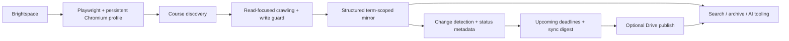

# CourseMirror

**CourseMirror — for D2L Brightspace**

[](https://github.com/aryanramz/coursemirror/actions/workflows/ci.yml)
[](https://github.com/aryanramz/coursemirror/releases/latest)
[](LICENSE)
[](https://nodejs.org/)

**Keep a structured, term-aware local mirror of the Brightspace content you can already access.**

CourseMirror is a read-focused authenticated crawler and incremental course-mirroring pipeline for D2L Brightspace. It uses Playwright with a dedicated persistent Chromium profile, discovers courses dynamically, captures student-visible course data, tracks meaningful changes, and optionally publishes the mirror to a Google Drive for desktop folder for downstream search or AI workflows.

> CourseMirror is an unofficial third-party utility for D2L Brightspace. It is not affiliated with or endorsed by D2L Corporation.

Users are responsible for complying with their institution's policies, applicable terms of service, and copyright rules.

## Why this exists

Brightspace is useful as a live LMS, but less convenient as a durable personal archive or machine-readable knowledge source. CourseMirror turns the student-visible parts of an account into a predictable filesystem structure that can be searched, diffed, archived by semester, or connected to downstream tooling.

Typical use cases include:

- keeping a personal semester archive
- checking what changed since the last sync
- searching course material outside the LMS UI
- feeding a private course mirror into retrieval or AI tooling
- maintaining a local copy of assignments, announcements, course content, and supported files

## Highlights

- Persistent browser-session reuse with normal SSO/MFA when required
- No standalone plaintext cookie/storage-state export
- Post-login network write guard for state-changing request methods and suspicious form/action POSTs
- Automatic compatibility-tested detection of Microsoft Edge, Google Chrome, and Brave, with best-effort Vivaldi, Opera, Opera GX, and Chromium support
- Manual selection and isolated compatibility probing for other Chromium-family executables
- Locked npm dependency graph for reproducible installs
- Dynamic course discovery
- Quick and Full synchronization modes
- Term-aware historical archive structure
- Change detection that normalizes common Brightspace UI noise
- Cross-course upcoming-deadlines index for assignments, quizzes, and calendar events
- Human-readable and machine-readable sync digests
- Student-visible assignments, quizzes, grades, announcements, calendar, discussions, and course content
- Selective asset downloading with configurable size limits
- Incremental Google Drive for desktop publishing
- Shared process locking to prevent overlapping sync/publish operations
- Smart scheduled sync: Quick normally, Full after the configured interval
- Windows launchers and Task Scheduler friendly operation
- Local status, manifest, and change metadata for downstream tooling

## Architecture



This is closer to an authenticated synchronization pipeline than a one-off scraper.

## Example output

The repository includes a **fully synthetic sample mirror** so you can inspect the output format without exposing real course or student data:

[`examples/sample-mirror/`](examples/sample-mirror/)

```text
BrightspaceMirror/
├── 2026-Fall/
│   └── CSC 210 - Systems Programming [123456]/
│       ├── _course.json
│       ├── _course_status.json
│       ├── _latest_changes.json
│       └── assignments/
│           └── page.txt
├── _school/
│   ├── current.json
│   ├── upcoming.json
│   ├── upcoming.md
│   ├── sync-digest.json
│   └── sync-digest.md
└── _system/
```

Example Quick Sync behavior:

```text
Existing Brightspace session found — continuing without login.
Sync mode: QUICK
Courses discovered: 6
Changes: 1 added, 0 updated
Upcoming deadlines indexed: 12
Sync digest entries: 1
Drive publish: 7 copied, 2284 unchanged, 0 failed
Sync complete.
```

## Requirements

- Windows 10 version 22H2 (build 19045) or later, or Windows 11, on x64 hardware
- .NET Framework 4.8 or later
- Microsoft Edge, Google Chrome, Brave, or another compatible Chromium-family browser
- Access to a Brightspace environment through a normal student account
- Optional: Google Drive for desktop if using Drive publishing

The Windows installer includes its own private Node.js runtime, so installed users do not need Node.js, npm, Git, or administrator access. Browser binaries are intentionally not bundled. Source-checkout development still requires Node.js 20 or later.

CourseMirror is currently packaged and tested as a **Windows desktop application**. macOS, Linux, iOS, iPadOS, Android, ARM64, and Firefox are not supported targets in this release candidate.

## Windows 3.0 release candidate

The reviewed Windows build installs per-user to `%LOCALAPPDATA%\Programs\CourseMirror` and keeps configuration, the authenticated browser profile, state, and logs separately under `%LOCALAPPDATA%\CourseMirror`. The school mirror remains user-selectable, and Google Drive publishing remains a separate opt-in filesystem destination.

On a fresh install, the control panel opens setup automatically. **Save & Sign In** safely persists settings, opens the existing visible SSO/MFA flow, and starts one initial Full Sync only after authentication succeeds. Settings can retry browser detection, choose and validate a Chromium executable, return to automatic detection, or open Microsoft's fixed Edge download page when no compatible browser is present. Microsoft Edge, Google Chrome, and Brave are officially tested; Vivaldi, Opera, Opera GX, and Chromium are best-effort compatible.

First run can explicitly import supported configuration, BrowserProfile session data, and continuity state from a user-selected CourseMirror or pre-rename Brightspace Sync source checkout. It never scans the disk, moves the school mirror, copies Drive output, modifies the old checkout, or imports source code, Git data, dependencies, logs, or plaintext credentials.

Automatic scheduling is optional. Update checking uses public GitHub Releases metadata, downloads or installs nothing, and has no telemetry. Default uninstall removes the application and its exact scheduled task while preserving private data, credentials, the school mirror, and Drive output unless the user explicitly selects private-data removal.

The 3.0.0 installer remains unsigned during release-candidate review and may appear as **Unknown Publisher**. Do not disable Defender or SmartScreen; final clean-VM qualification and public release are separate work.

## Quick start

For the Windows release candidate, run `CourseMirror-3.0.0-Setup.exe`, then launch CourseMirror from the Start Menu and complete the guided first-run flow. The installer is per-user and requires no elevation.

For source-checkout development:

1. Clone the repository and install the locked dependencies:

   ```powershell
   git clone https://github.com/aryanramz/coursemirror.git
   cd coursemirror
   npm ci
   ```

   Or run `setup.ps1`, which installs the locked dependency graph, initializes the per-user configuration, and runs the environment doctor.

2. Run the doctor once to initialize and display the user configuration path:

   ```powershell
   npm run doctor
   ```

   The normal Windows path is `%LOCALAPPDATA%\CourseMirror\config.json`.

3. Edit that `config.json` and set at minimum:

   ```json
   {
     "baseUrl": "https://your-school.brightspace.com",
     "outputDir": "D:\\CourseMirror"
   }
   ```

   `outputDir` is user-selectable. If it is blank, the default is `Documents\CourseMirror` in the current Windows profile.

4. Run the login setup helper:

   ```text
   SETUP_LOGIN.cmd
   ```

   Sign into your institution normally. SSO and MFA remain under your institution's control. CourseMirror does not require your password in code or configuration.

5. Run a Full sync first:

   ```text
   FULL_SYNC.cmd
   ```

6. Use Quick syncs for normal daily updates:

   ```text
   QUICK_SYNC.cmd
   ```

## Authentication model

The crawler uses a dedicated persistent Chromium profile under:

```text
%LOCALAPPDATA%\CourseMirror\BrowserProfile\
```

If a valid Brightspace/SSO session exists, syncs can usually continue without another login.

If the session expires, the browser may require you to complete login and MFA manually. `SETUP_LOGIN.cmd` opens the same dedicated profile so you can establish or refresh authentication without storing credentials in project files.

The project does not require username or password fields in `config.json`. v2.4.1 no longer exports Playwright `storageState` to a separate plaintext JSON file; session persistence is left to the dedicated Chromium profile. If the legacy `_brightspace-auth-state.json` file from v2.4.0 exists, the crawler removes it automatically.

The profile itself still contains sensitive browser/session data and should be protected like any authenticated browser profile.

## Windows storage model

Application files and user data are deliberately separated so a future installer can place the application under `Program Files` without requiring it to write there:

```text
Application directory (read-only capable)
  src/, package.json, node_modules/, launchers

%LOCALAPPDATA%\CourseMirror\
  config.json
  BrowserProfile\
  state\
  logs\

User-selected location
  Brightspace mirror
```

All commands resolve the application directory from the running module rather than the current terminal directory. The `.cmd`, PowerShell, npm, scheduled, login, sync, and publish entry points all use the same stable launcher and runtime path abstraction.

On first use after the product rename, CourseMirror transactionally copies an existing `%LOCALAPPDATA%\Brightspace Sync` runtime root to `%LOCALAPPDATA%\CourseMirror` when the new root has no meaningful data. Configuration, BrowserProfile, state, and logs are preserved, while the selected school mirror remains in its existing location. The old runtime root is retained for rollback. If both roots contain meaningful data, startup stops with a manual-review conflict instead of merging or overwriting them. Existing repo-relative migration remains supported and idempotent. See [`docs/WINDOWS_DISTRIBUTION.md`](docs/WINDOWS_DISTRIBUTION.md) for the detailed contract.

## Sync modes

### Quick Sync

Designed for routine use. It checks high-value changing areas such as assignments, quizzes, grades, calendar, and announcements while skipping the deepest Content/module/discussion crawling for speed.

### Full Sync

Performs a deeper crawl including course Content/modules, discussions, supported assets, and additional verification work.

`SCHEDULED_SYNC.cmd` can automatically choose between Quick and Full based on the age of the last successful Full sync.

## Mirror layout

The local mirror uses a term-scoped schema:

```text
BrightspaceMirror/
├── 2026-Fall/
│   ├── Course A [123456]/
│   └── Course B [234567]/
├── 2027-Spring/
├── _school/
└── _system/
```

- **Term folders** contain full per-course mirror trees.
- **`_school/`** contains lightweight cross-course summaries and current-term indexes.
- **`_system/`** contains crawler schema, state, migration, debug, and publishing metadata. `_system/` is not published to Drive by default.

## Cross-course indexes

Every successful Quick or Full sync generates cross-course views under `_school/` before Drive publishing.

### `upcoming.json` and `upcoming.md`

The upcoming-deadlines index normalizes dated work across active courses into one list. It extracts upcoming assignments, quizzes, and calendar events, removes obvious duplicate calendar copies of assignment/quiz deadlines, and sorts everything chronologically.

Machine-readable items include fields such as:

```json
{
  "course": "CSC 210 - Systems Programming",
  "type": "assignment",
  "title": "Homework 2: Processes and Pipes",
  "dueAt": "2026-09-29T03:59:00.000Z",
  "dueDate": "2026-09-28",
  "deadlineBasis": "due",
  "url": "https://brightspace.example.edu/assignment/1002"
}
```

The same index is also written as Markdown for fast human or LLM retrieval. Active terms receive term-scoped copies under `_school/<term>/`.

### `sync-digest.json` and `sync-digest.md`

The sync digest turns raw change metadata into a compact cross-course summary of what was added or updated during the latest run. Student-facing changes are grouped separately from technical mirror changes such as asset-index/file updates.

It also performs deadline-change intelligence by comparing the newly generated deadline set with the previous sync. The digest can identify newly dated work, due-date/time changes, and deadline removals while avoiding false "deadline removed" reports when an item itself disappears from Brightspace.

This makes questions such as "what changed since the last sync?" and "what do I have due this week?" answerable from small, purpose-built files instead of scanning every course tree.

`_school/current.json` points to the current upcoming-deadlines and sync-digest files.

## Google Drive publishing

Drive publishing is optional and disabled by default in `config.example.json`.

Enabling it requires both an explicit `enabled: true` choice and a destination selected by the user:

```json
{
  "drivePublish": {
    "enabled": true,
    "destination": "G:\\My Drive\\CourseMirror"
  }
}
```

The intended model is Google Drive for desktop in streaming or mirrored mode. CourseMirror copies the local mirror into a mounted Drive path rather than implementing OAuth itself.

The publisher is incremental: it copies new or changed files, leaves unchanged files alone, removes only files it previously published that were later removed locally, does not purge unrelated user files, and verifies tracked files during Full publishing.

To publish manually:

```text
PUBLISH_TO_DRIVE.cmd
```

## Scheduling

`SCHEDULED_SYNC.cmd` chooses a mode automatically:

- Quick if the last successful Full sync is newer than the configured interval
- Full once the configured Full interval has elapsed

This works well with a single daily Windows Task Scheduler task because a missed weekly Full is not permanently skipped just because the computer was offline at a specific scheduled time.

## Assets

The crawler can download common course assets such as PDF, DOC/DOCX, PPT/PPTX, XLS/XLSX, text files, images, archives, and caption files such as VTT/SRT.

Large video/audio binaries are index-only by default. Asset behavior and size limits are configurable.

## Privacy and safety

CourseMirror is designed to avoid submissions, edits, and other intentional state-changing operations. After authentication, the request guard blocks `PUT`, `PATCH`, and `DELETE`, blocks same-origin form/document `POST` requests, and blocks POST endpoints/bodies that look state-changing. Brightspace also uses some POST-based RPC/XHR requests for read operations, so benign read-like POSTs remain allowed.

That means the project is **read-focused, not mathematically read-only**. Visiting Brightspace pages can still update normal platform metadata such as viewed state or "Last Visited" information.

Never commit or share:

- `%LOCALAPPDATA%\CourseMirror\BrowserProfile\` (and legacy `.brightspace-profile/`) — browser cookies, sessions, and potentially saved-login information
- the user-selected mirror (and legacy `BrightspaceMirror/`) — private student/course content
- `%LOCALAPPDATA%\CourseMirror\config.json` (and legacy repo `config.json`) — local machine configuration
- logs or exported data containing private academic information

These paths are ignored by the included `.gitignore`. CI also scans the working tree and full Git history for known credential formats, institution-email/URL patterns, student-ID-like fields, and forbidden sensitive paths. See [SECURITY.md](SECURITY.md) for the full security model.

## Development

Run the included checks:

```powershell
npm run selftest
npm run publish-selftest
npm run lock-selftest
npm run runtime-paths-selftest
npm run school-indexes-selftest
npm run deadline-intelligence-selftest
npm run asset-index-selftest
npm run write-protection-selftest
npm run security-selftest
npm run history-security-selftest
```

On Windows, you can also run:

```powershell
npm run doctor
npm run windows-browser-smoke
```

GitHub Actions runs the functional/security checks on Node.js 20, 22, and the distributed Node.js 24.20.0 runtime, performs a full-history privacy scan, and runs a clean `windows-latest` smoke job that detects an installed Chromium browser and launches it through Playwright with a temporary persistent profile.

## Scope and compatibility

Brightspace deployments differ between institutions, and D2L can change its frontend without notice. This project is based on browser automation rather than an official D2L integration, so selectors may require maintenance over time.

The crawler is intended only for content visible to the signed-in user. It is not intended to bypass permissions, access restricted content, automate submissions, or evade institutional authentication controls.

A green Windows smoke test proves the packaged Node/Playwright/browser path works on a clean GitHub-hosted Windows environment; it does **not** prove every institution's Brightspace/SSO deployment will behave identically. Real Brightspace compatibility still depends on the target institution.

## Release

Latest stable release: **[v2.4.1](https://github.com/aryanramz/coursemirror/releases/tag/v2.4.1)**

Current reviewed release-candidate source version: **3.0.0**. Version 3.0.0 has not been tagged or publicly released.

## License

Licensed under the [MIT License](LICENSE).
